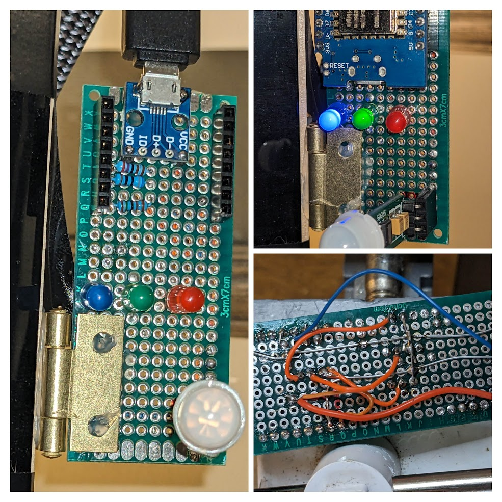

# wemos-pir-to-mqtt

This Arduino-based project utilizes the LOLIN(WEMOS) D1 mini (clone) board to monitor Wi-Fi and MQTT connections through LED indicators. Additionally, a passive infrared (PIR) sensor detects state changes and detects if the door is opened.

_Image of my installation attached to the side of my monitor with LEDs and PIR (HC-SR505)_

## Features

- **LED Indicators:**

  - Red (PIN D8): Indicates disconnected Wi-Fi or MQTT. (~ 1.5k ohms resistor)
  - Blue (PIN D5): Denotes Wi-Fi connection status. (~ 2.7k ohms resistor)
  - Green (PIN D7): Represents MQTT connection status. (~ 800 ohms resistor)
  - White (PIN D6): Represents Door open / closed status. (~ 2.2k ohms resistor)

- **PIR Sensor:**

  - Connected to PIN D2. Part: HC-SR505

- **Door magnetic Sensor:**

  - Connected to PIN D1.

- **MQTT Communication:**
  - Sends MQTT messages every 10 seconds regardless of state changes.
  - Also eports immediate state changes detected by the PIR sensor.

## Usage

1. Update `config.h` with your WIFI and MQTT credentials. (copy config.h.example to config.h)
2. Upload the code to the LOLIN(WEMOS) D1 mini board.
3. Connect LEDs to their respective pins as specified.
4. Connect the PIR sensor to PIN D2.
5. Connect the DOOR sensor to PIN D1.
6. Observe LED indicators for Wi-Fi and MQTT statuses.
7. Check the serial monitor for additional debug information.
